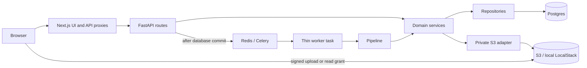

# Vroometr implementation guide

Reviewed against the working tree on 2026-09-17, through roadmap task 5.5 citations + safety.
For the numbered V1 sequence, use the [roadmap](roadmap.md). For setup, use the
[runbook](development-runbook.md). For per-task evidence and review steps, use
[implementation progress](implementation-progress.md).

## Current capabilities

| Area | Implemented | Remaining boundary |
| --- | --- | --- |
| Foundation | FastAPI, Next.js, SQLAlchemy/Alembic, local Postgres/pgvector, Redis, LocalStack S3, Unleash, CI image builds | Production deployment is not implemented in `deploy/` |
| Identity | Clerk session verification, signed webhooks, local users and role/entitlement fields | Billing and comprehensive entitlement gates are future work |
| Age eligibility | Date of birth, eligibility calculation, versioned consent records and APIs | No complete guardian verification/onboarding flow or global eligibility enforcement |
| Garage | Owner-scoped bike create/list/detail/update, archive/restore, combustion/electric validation | Generated personalized garage scenes are not implemented |
| Active context/dashboard | Persisted active bike; real identity, powertrain, and hours in the shell/dashboard | Maintenance, ride, and other domain cards remain empty or placeholder UI |
| Files, 3.1–3.3 | Private uploads, verification, quota, bike links, previews/downloads, unlink/relink, confirmed deletion | Only bike attachment targets are supported today |
| Background checks, 3.4 | Durable attempts, Celery dispatch, retry, scan status UI | Scanner is unconfigured; no actual malware scan |
| Document records, 4.1 | PDF preflight/hash, drafts, metadata confirmation, editions, primary manual, duplicate warnings | AI metadata proposals are not implemented |
| Ingestion, 4.2 | Async native text, page scores/classes, provenance, partial failure/retry and review UI | OCR/vision providers deferred; only completed native pages are searchable |
| Sections/chunks, 4.3 | Hierarchy, exact text spans, pgvector vectors, embedding adapter, retries, review UI | Live synthetic-text embedding check passed; full UI/worker/provider flow remains manual |
| Retrieval, 4.4 | Owner-filtered vector + keyword search, RRF/dedup, reranking, bounded source excerpts, citations and search UI | First source-backed retrieval evals pass; broad full-manual benchmarks and generated answers remain future work |
| Conversations, 5.1 | Bike-scoped threads, messages, deterministic rolling summary, bike-switch boundaries, owner HTTP API, minimal Assistant UI | No agent replies yet |
| Compact context, 5.2 | Always-load bike/hours/powertrain + recent turns/summary pack, deferred domain stubs, context endpoint/panel | Mods/maintenance/rides await Phases 6–7; agent replies remain |
| Assistant tools, 5.3 | Read-only registry over bike/context/manuals/conversation services | ReasoningAgent / ChatModel tool-calling deferred |
| Write policy, 5.4 | Auto vs confirm classes, `FLAG_AI_WRITES`, confirmation/explicit-instruction gate | No durable write tools until Phase 6+ domains; no NLP classifier |
| Citations/safety, 5.5 | Withhold unverified critical specs; citation payloads; risk-based escalation helpers | No answer generator / UI chips yet; agent must call these helpers |
| AI foundation | Provider-neutral ports, OpenAI embedding/reranker adapters, feature flags, chunking/retrieval baseline evals | Chat/summary adapters and the ReasoningAgent remain unconfigured; mechanical-answer evals remain future work |

A visible navigation page is not evidence that its backend domain exists. Maintenance,
rides, modifications, issues, and settings contain presentation scaffolding; suspension is
Coming Soon. Assistant persists conversations, exposes always-load compact context, has
read-only tools, gates future writes, and has citation/safety helpers (5.1–5.5), but does not
answer yet. Do not report later Phase 5 workflows as complete.

## Runtime architecture

Clerk proves identity; the Vroometr database owns roles, entitlements, and bike ownership.
Next.js session middleware improves navigation but does not authorize backend operations.
`apps/web/lib/fastapi.ts` forwards authenticated requests; FastAPI verifies the token again.

`services/api/app/deps.py` assembles services, repositories, and adapters. Its `get_db` dependency
commits a successful request, then dispatches collected processing messages. Exceptions roll
back the transaction; sessions close in all cases. Repositories flush when needed, while the
request or pipeline owns transaction completion. S3 and Postgres are separate systems, so their
writes are not one atomic transaction.

The repeated names in `routes/documents.py`, `services/documents.py`,
`repositories/documents.py`, and `models/document.py` represent different responsibilities:

| Layer | Owns | Example |
| --- | --- | --- |
| Route | Request/response schemas, authentication dependency, error-to-HTTP mapping | Reject malformed request bodies; call `DocumentService.confirm` |
| Service | Authorization and domain decisions | Require confirmation before primary selection |
| Repository | Queries and persistence | Owner-scoped document lookup and primary update |
| Model/migration | Stored shape and database constraints | At most one primary document per bike |

Future AI tools must call these same services. They must not implement parallel write rules or
access the database directly. Mechanical specifications must come from authoritative sources;
retrieval now provides cited source excerpts but does not generate or verify answers.

## Identity and eligibility

Start with `app/auth/tokens.py`, `app/deps.py`, and `app/services/users.py` under `services/api/`.
An authenticated Clerk subject is mapped to a local user with retry-safe creation. New users
default to role `user` and entitlement `none`. Browser-provided roles are not authoritative.

`app/auth/webhooks.py` verifies webhook signatures. `ClerkSyncService` handles `user.created`
and `user.updated` by ensuring the local identity exists. It does not synchronize roles or
entitlements, and it does not implement account deletion on `user.deleted`.

`AgeGateService` calculates unknown/adult/needs_consent/consented/blocked_under_13 states.
Setting an under-13 date of birth is rejected. Consent records store guardian contact, consent
version, status, and timestamps for the signed-in account. The current endpoint records a
granted consent; it does not independently prove guardian identity. Existing domain endpoints
use `get_current_user`, not a universal eligibility/entitlement gate. Keep this distinction
visible when completing onboarding or billing later.

## Bikes, active context, and web shell

Read `app/services/bikes.py` and `active_bikes.py`, then the matching repositories and routes.
`BikePatch` distinguishes omitted fields from explicitly cleared nullable fields. Validation
happens before applying updates. Combustion bikes require positive displacement and a stroke
type; electric bikes require both fields to be null. The rationale is recorded in
[ADR 0001](adr/0001-electric-bike-powertrains.md).

Engine hours use decimal tenths and retain an estimated/confirmed indicator. Null means unknown.
Archive/restore changes bike status rather than deleting its history. There is no bike deletion
endpoint. An archived bike cannot be selected as active; resolving a stale active selection
chooses an available non-archived bike or clears the selection.

`ActiveBikeProvider.tsx` and `ActiveBikeSelector.tsx` share that context across the shell.
`BikeForm.tsx`, `GarageList.tsx`, and `BikeDetails.tsx` implement garage operations.
`components/dashboard/DashboardOverview.tsx` composes live bike data with honest empty states.
`lib/nav.ts`, `GarageShell.tsx`, and `app/globals.css` control navigation and presentation.
Scene images are static assets in `apps/web/public/`, not generated personalized scenes.

## Attachments, links, and document records

These are separate concepts:

| Record | Meaning | Removing it |
| --- | --- | --- |
| `attachments` | One private stored file, its owner, size, MIME type, purpose, and upload state | Global file deletion also removes related links, processing, and document records |
| `attachment_links` | A reusable relationship from a file to an entity; only `bike` today | Unlink preserves the stored file and document records |
| `attachment_processing` | Durable attempt and scanner state for an attachment | Cascades when the attachment is deleted |
| `documents` | Bike-specific PDF metadata, confirmation, version family, and primary status | References an attachment; it is not a second copy of the bytes |

The account quota counts an attachment once even when it is linked or registered for multiple
purposes. Document records can reference account files independently of generic bike links.
Consequently, removing a file's generic bike link does not remove that bike's document record.

### Upload and file management

1. `DocumentUpload.tsx` requests a grant from `/v1/uploads/presign`.
2. `UploadService` validates type/size, locks the owner for quota reservation, and creates a
   pending attachment. The browser receives a constrained S3 POST policy.
3. The browser uploads bytes directly to private storage, then calls the completion endpoint.
4. The backend checks stored size, MIME type, and attachment identity metadata before marking
   the upload complete. This verification is not content scanning.
5. Processing is queued and dispatched after commit. The UI links the file to the active bike;
   link failure can be retried without uploading another copy.

Current byte limits are `100 * 1024 * 1024` for PDFs, `15 * 1024 * 1024` for permanent images,
and `5 * 1024 * 1024 * 1024` pooled storage, presented as MB/GB in product language.
Pending uploads reserve quota. Trusted temporary troubleshooting and generated-scene purposes
are excluded; clients cannot select these exclusions. Billing gates are not yet implemented,
so the same quota applies to current pre-billing access. No automatic pending-upload cleanup
has been added.

`DocumentLibrary.tsx` lists active-bike files or all account files, including unlinked/pending
ones. Read grants expire after 60 seconds. View uses a sandboxed iframe; Download uses an
authorized storage URL. Known infected files cannot receive new read grants. Existing grants
cannot be immediately revoked, and unscanned files retain access with explicit labels.

Delete requires confirmation and waits until the 15-minute upload grant expires, preventing
that grant from recreating the object after deletion. S3 deletion happens before metadata
deletion. Storage failure preserves metadata/quota. If storage succeeds but the database fails,
retry completes cleanup; the file may already be unavailable during that interval.

### Processing attempts

Read `app/services/attachment_processing.py`, `app/processing/dispatch.py`,
`pipelines/attachment_processing.py`, and `workers/tasks.py`.

Postgres stores queued/running/completed/failed attempt state. Redis transports work identifiers.
Workers claim an attempt before work; attempt fencing prevents duplicate or stale completion
from replacing a newer result. `PROCESSING_LEASE_SECONDS` determines when stalled queued/running
work can be retried. UI polling follows persisted state, not a simulated progress timer.

Publication happens after commit. Broker failures are recorded as failed when possible; a crash
between commit and publication can leave a queued row. Manual retry after the lease is the
current recovery mechanism; no automatic reconciliation scheduler exists.

The scanner adapter is explicitly unconfigured and returns `not_scanned`; it does not inspect
file contents. Completed checks therefore do not mean clean. Errors or an unconfigured scanner
cannot clear an existing infected verdict. `ProcessingStatus.tsx` exposes run/retry and status.
Real scanning is tracked in the [planned 3.4 follow-up](implementation-progress.md#planned-follow-up-real-malware-scanning),
including scanner selection, binding verdicts to file versions, and real integration tests.

### PDF documents and editions

`DocumentRecords.tsx` registers an uploaded PDF as a manufacturer manual or supporting document.
`DocumentService.register` checks ownership, uploaded state, infection status, and PDF validity,
then computes SHA-256 and stores an awaiting-confirmation draft. Duplicate matches are scoped
to the account and produce a warning; files are never silently merged.

Make/model/year initially come from the bike profile, explicitly labeled as defaults. They are
not extracted or proposed by AI. `confirm` accepts corrections and rechecks the bytes against
the stored hash. Confirmed metadata is preserved; changing it requires a new edition.

Explicitly choosing a predecessor joins a version group with an increasing revision. A new
confirmed edition archives earlier records in that group. Confirming a manufacturer manual
makes it primary; a database partial unique index enforces at most one primary per bike.
Supporting documents cannot be primary. An older confirmed manual can be selected explicitly.
Retrying confirmation does not undo a later primary override. Deleting a predecessor preserves
later editions' group/revision while clearing their predecessor reference.

`PdfDocumentInspector` uses PyMuPDF to reject malformed, empty, and encrypted PDFs. This is
synchronous preflight within the file limit, not the future extraction pipeline. Confirmation
and primary selection recheck hashes, but upload grants can rewrite bytes until expiration.
The ingestion pipeline reads one bytes snapshot, verifies its hash, and extracts all pages
from that snapshot. It does not make the original storage object immutable.

## Page ingestion (4.2)

After confirming document metadata, choose Extract pages. `GET/POST /v1/documents/{id}/ingestion`
reads status or queues/retries extraction through `DocumentIngestionService`. Ownership,
confirmation, and known infection are checked on the server. The request commits before
publishing `vroometr.process_document`; its thin task calls `pipelines/document_pipeline.py`.

`document_ingestion` stores the attempt, state, lease, pipeline version, page count, and error.
`document_pages` stores zero-based original page indexes, native text, score/reasons, processing
class, page state, source hash, and extraction/OCR/vision versions. The UI displays indexes + 1;
these are physical PDF pages, not printed page labels. Original PDFs are retained in storage.

The pipeline verifies one in-memory snapshot against the registration hash before opening it
with PyMuPDF. Each page result commits separately. A page failure does not discard successful
pages. Retry retains completed pages with matching hash/extraction version and retries incomplete
ones. Attempt fencing rejects duplicate claims and late writes; each page commit refreshes the
existing processing lease. Queue outages persist failure when possible; crash recovery remains
manual retry after lease expiry. Known infection blocks result access and new page commits.

`app/documents/extraction.py` uses native text, image coverage/count, vector drawing count,
sparse text, and language hints to score/route pages. These versioned heuristics are a starting
point, not a measured classifier. Classes are `text_only`, `ocr_enhanced`, and `ocr_vision`.
A failed classification uses a fallback class with explicit failed state/reason; never interpret
its score as a successful classification. Blank native pages can complete with empty text.

Drake approved native-text extraction/routing now and providers later. Visual pages retain
available native text but remain `pending_provider`, making the overall result `partial`.
OCR and vision versions stay null. Repeated retries cannot supply missing providers. OCR/vision
benchmarking and AI metadata proposals remain future work. Sections/chunks and embeddings
are now implemented separately in 4.3.

`DocumentIngestion.tsx` polls persisted status, supports manual refresh and incomplete-page
retry, and renders escaped text excerpts (up to 4,000 characters per page). Full native text is
saved in Postgres; pagination and large-document UI optimization remain future work. No new
infrastructure, dependencies, or environment keys were introduced. Restart API/worker after
applying migration 0011. See the [4.2 handoff](implementation-progress.md#page-ingestion-42--2026-09-11).

## Sections, chunks, and embeddings (4.3)

After extraction, Build sections & embeddings queues an owner-authorized indexing attempt.
The worker verifies the PDF hash, reads its outline, and builds chunks from completed saved
pages. PDF bookmarks preserve parent relationships; unique matching titles establish text
boundaries. Numbered-heading heuristics or explicitly labeled page groupings are fallbacks.
Ambiguous same-page outline boundaries use page grouping rather than claiming exact sections.

Chunks never cross a page or section boundary. Each has global and per-section indexes,
original page mapping, end-exclusive Unicode character offsets into saved page text, source
hash/extraction version, and chunking version. Table/diagram labels are candidates derived
from text, not verified table structure or visual interpretation. Pending OCR/vision and failed
pages are excluded. See [document indexing](document-indexing.md) for details and limits.

Postgres stores 1,536-dimensional vectors with embedding model/version metadata. The adapter
uses the existing EmbeddingModel port and HTTPX. Building with no provider credentials saves
sections/chunks and stops at awaiting_configuration. When configured, this action sends
completed-page text to OpenAI; no other model port is enabled by these credentials.

Each embedding batch commits independently. Retry reuses this document's identical inputs
under the same model/version; changed configuration causes re-embedding. New extraction
attempts make old indexes stale and reject in-flight results. Retrieval excludes
stale indexes and enforces ownership, infection checks, and matching embedding configuration.

## Schema and migrations

All migrations live in `services/api/alembic/versions/`. Apply them explicitly; API startup
does not migrate the database. Never rewrite an already-applied migration.

| Migration | Purpose |
| --- | --- |
| `0001_alembic_setup` | Migration baseline |
| `0002_users` | Local identity, roles, entitlements |
| `0003_parental_consents` | Age/consent persistence |
| `0004_bikes` | Owner-scoped machines |
| `0005_active_bike` | Persisted user active-bike reference |
| `0006_electric_bikes` | Powertrain and combustion/electric constraints |
| `0007_attachments` | Private-upload metadata |
| `0008_attachment_links` | Reusable file relationships |
| `0009_attachment_processing` | Durable attempts and scanner state |
| `0010_documents` | PDF metadata, confirmation, versioning, primary constraints |
| `0011_document_ingestion` | Durable extraction attempts and original-page text/routing/provenance |
| `0012_document_chunks` | Section hierarchy, exact source chunks, pgvector embeddings, and indexing attempts |
| `0013_retrieval_fts` | GIN full-text index for hybrid document retrieval |
| `0014_conversations` | Bike-scoped conversations, messages, and context boundaries |

Read models for exact fields and constraints; read repositories for query behavior. Database
cascades remove dependent rows, not S3 objects by themselves. Account/bike permanent deletion
must not be inferred from the existence of foreign-key cascades.

## Shared libraries and unfinished systems

`libs/vroometr/settings.py` reads runtime settings. Real values belong in `.env`/host environment;
`.env.example` is a key catalog only. Do not paste secrets into documentation or test reports.

`libs/vroometr/flags.py` provides OpenFeature access with Unleash or an in-memory provider.
Named flags cover web research, vision, voice, and AI writes. These flag definitions do not
implement those capabilities; tests use in-memory flags.

`libs/vroometr/ai/ports.py` defines chat, embedding, reranker, vision, image, speech-to-text,
and text-to-speech contracts. Embedding and reranker factories return OpenAI adapters when configured;
other factories remain unconfigured. `evals/chunking.py` checks source integrity;
`evals/retrieval.py` checks offline baselines and optional live synthetic relevance/injection cases.
`evals/manuals.py` adds twelve source-backed/synthetic cases over real PostgreSQL with recorded
or live provider outputs. Broad full-manual benchmarks and mechanical-answer evals remain future work. `deploy/` has no staging/production
rollout config.
CI builds images but does not deploy. Current CI starts Postgres, but not Redis or LocalStack;
those integration tests require local verification and may skip in CI. This remains a gap
relative to the design's intended AWS-shaped CI coverage.

## Extending the implementation

Follow the same path for a new feature: model/migration if necessary, repository operations,
domain service rules, route schemas and error mapping, authenticated web proxy, UI states,
then appropriate unit/API/integration verification. Keep model calls behind the existing AI
ports and background orchestration in pipelines. Add an ADR when an approved architectural
decision needs explanation.

The next numbered task is 5.6 on the [roadmap](roadmap.md). OCR/vision providers remain a
separate follow-up; routed pages are not completed OCR/vision output. Update this guide, the roadmap status, affected subsystem
documentation, and the progress log as part of finishing each task; use the
[documentation standard](documentation-standard.md).

## Hybrid document search (4.4)

`POST /v1/retrieval` calls `RetrievalService` for authorized, synchronous search of indexed
sources. The default is the primary manual plus active supporting documents; reference editions
are opt-in. `RetrievalRepository` applies the same owner/freshness predicates to vector, keyword,
neighbor, and final snapshot reads. RRF/dedup → scored reranking → adaptive matches → useful
same-section neighbors → whole-passage budget yields at most eight passages and 8,000 source
characters. Revalidation rejects source changes during provider calls. No generated answers or
mechanical correctness claims are produced. See [retrieval](document-retrieval.md) for the exact
API/port contracts, confidence limits, GIN migration, settings, evals, and review steps.

## First manual retrieval evals (4.5)

`evals/manuals.py` now runs twelve fixed source-backed/synthetic cases through real extraction,
chunking, PostgreSQL, and `RetrievalService`. Recorded-provider mode is deterministic and runs
in CI; live mode checks configured models. Gold checks cover source/value/condition retention,
exact citations, missing evidence, pending visuals, injection exclusion, and owner isolation.
All fixture rows roll back. Read [manual evaluations](manual-evaluations.md) before editing
fixtures or replacing provider recordings. This is a small initial retrieval gate; diagram
understanding and generated-answer withholding still require future capability-specific evals.

## Conversations (5.1)

`/v1/conversations` creates and lists bike-scoped threads, loads messages/boundaries, appends
messages, switches bike context, and deletes conversation content. List filtering matches
`initial_bike_id` or `current_bike_id` so a thread remains visible after an explicit bike switch.
Rolling summaries are deterministic (`deterministic-v1`) until chat/summary models are wired.
The Assistant page stores user messages only; agent replies are later Phase 5 work. See
[implementation progress](implementation-progress.md#conversations-51--2026-09-16).

## Compact context (5.2)

`GET /v1/conversations/{id}/context` returns the always-load `CompactContextPack`: bike identity,
hours, powertrain, recent turns (budgeted), rolling summary, and deferred stubs for
modifications/maintenance/rides. `CompactContextService.search_manuals` delegates to
`RetrievalService` for on-demand manuals (tools arrive in 5.3). See
[implementation progress](implementation-progress.md#compact-context-52--2026-09-16).

## Assistant tools (5.3)

`services/api/app/assistant_tools/` is a read-only registry (`get_bike`, `get_compact_context`,
`search_manuals`, `get_conversation`) that invokes the same domain services as HTTP. Mutating
tools are rejected until write policy (5.4). There is no agent loop yet. See
[implementation progress](implementation-progress.md#assistant-tools-53--2026-09-17) and
[assistant_tools README](../services/api/app/assistant_tools/README.md).

## Write policy (5.4)

`write_policy.py` classifies mutating tools as `auto` (low-risk metadata/summaries) or `confirm`
(durable machine writes). `ToolRegistry.invoke` checks `FLAG_AI_WRITES` and requires
confirmation or an explicit-instruction flag for confirm-class tools. Casual “I changed the oil”
cannot write without those flags. No durable write tools ship in the default registry yet. See
[implementation progress](implementation-progress.md#write-policy-54--2026-09-17).

## Citations and safety (5.5)

`citations.py` encodes LOCKED claim rules: cite when an authoritative manual source exists;
withhold exact safety/engine-critical numbers when it does not; allow clearly labeled
non-authoritative guidance only for lower-risk topics; escalate only for real risk reasons.
`decide_from_retrieval` builds Sources payloads from retrieval passages. See
[implementation progress](implementation-progress.md#citations-and-safety-55--2026-09-17).
