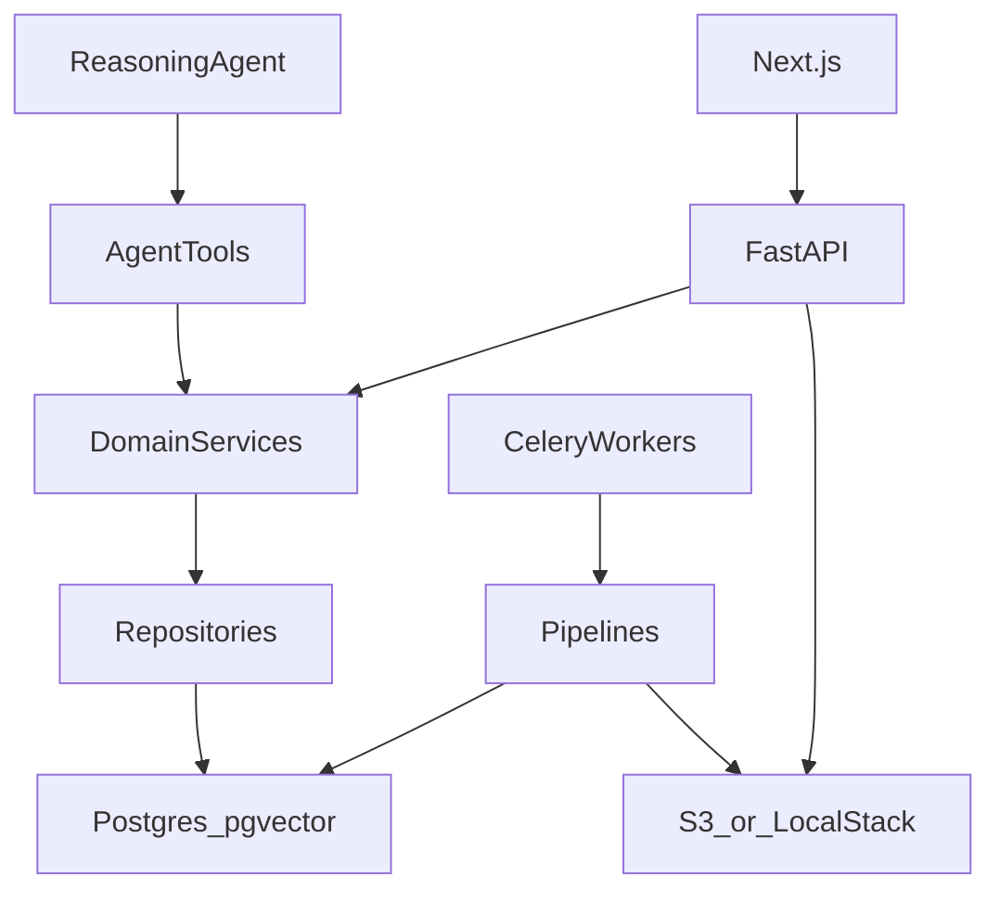

# Vroometr V1 Implementation Roadmap

This is the repository-owned V1 build sequence. Status here is authoritative for planning.
Detailed verification evidence lives in [implementation progress](implementation-progress.md).
LOCKED product and architecture decisions live in local `docs/design/` (not committed).

Last reviewed: 2026-09-11. Current position: **through 4.5 first retrieval evals**; next numbered task is **5.1**.

## Status at a glance

| Phase | Scope | Status |
| --- | --- | --- |
| 0 | Foundation | Complete |
| 1 | Auth and app shell | Complete |
| 2 | Bikes, garage, dashboard | Complete |
| 3 | Uploads and attachments | Complete (real malware scanning deferred; see follow-up) |
| 4 | Documents, ingestion, RAG | **4.5 first retrieval evals implemented**; OCR/vision and answer-safety follow-ups remain |
| 5 | Text assistant | Not started |
| 6 | Maintenance and engine hours | Not started |
| 7 | Modifications, rides, issues | Not started |
| 8 | Notifications, demo, Stripe | Not started |
| 9 | Garage generation (flagged) | Not started |
| 10 | Web research and voice (flagged) | Not started |
| 11 | Privacy, export, legal | Not started |
| 12 | Staging, prod, evals, monitoring | Not started |

Approved supplements that do not renumber later phases:

- Expanded Documents management UI under 3.3 (quota, view/download, unlink/relink, delete).
- [Real malware scanning](implementation-progress.md#planned-follow-up-real-malware-scanning)
  as a follow-up after the 3.4 processing framework.

## Product and architecture summary

Vroometr is a web-first motorcycle/dirt-bike ownership app: structured machine history plus a
bike-specific assistant. Durable facts live in Postgres, not opaque AI memory. REST and the
agent both go through the same domain services.

Locked stack we will not reopen: Next.js, FastAPI, Postgres + pgvector, S3, Celery + Redis,
nginx, one EC2 + Docker Compose, LocalStack in dev/CI, Clerk identity, Stripe billing,
OpenFeature + Unleash, GitHub Actions.

**Not locked in this roadmap:** reasoning-model vendor, OCR engine, STT/TTS, image-generation
model, exact RAG constants, final Pro price. Internal interfaces stay provider-neutral; model
names come from env.

## Frontend look (visual baseline only)

The original dashboard zip was a **visual mock**. Keep the glass HUD, scene backdrops, and
screen compositions. Do not inherit its vinext/Cloudflare/D1/ChatGPT runtime.

Canonical default scenes in `apps/web/public/`:

- `default-garage.jpg` — garage / dashboard and most views
- `rides-track.jpg` — rides view

UI stays real DOM over the image; never bake cards into generated or default scenes.

Locked V1 navigation:

Dashboard, Garage, Assistant, Maintenance, Rides, Documents, Modifications, Issues,
Settings, Suspension — Coming Soon.

## Repo layout

- `apps/web` — Next.js App Router UI
- `services/api` — FastAPI, domain services, repositories, later agent/tools
- `pipelines` — multi-step jobs called by thin Celery tasks
- `workers` — Celery app/tasks only
- `libs` — shared Python (flags, AI ports, settings)
- `infra` / `deploy` — Compose, LocalStack, later EC2/nginx
- `evals` — mechanical-spec / RAG / safety evals
- `docs/adr` — architecture decision records
- local `docs/design/` — LOCKED product/architecture decisions (not in git)

Python: Ruff, pytest, SQLAlchemy 2, Alembic. Frontend: TypeScript, App Router. Named product
components (`MaintenanceStatusCard`, `PlannedRideCard`, `AssistantFab`), not a generic card kit.

## How we build

1. Implement one task (not a whole phase).
2. Update repository documentation and give a developer handoff.
3. Drake reviews UI and/or code, then summarizes the feature back.
4. Next task only after an accurate summary — or an explicit “keep going.”
5. Hard stop at the end of every phase unless Drake says to continue.
6. If something LOCKED looks wrong, stop and discuss; do not silently redesign.

Readable-code rules: prefer obvious over clever; product names; one job per module; layers
`routes → services → repositories`; no drive-by refactors; subsystem READMEs stay current.

---

## Phase 0 — Foundation

Status: **complete**.

Scaffold the locked stack. Recreate the mock look in a new `apps/web`. No Clerk, no real agent,
no live bike data in this phase.

- **0.1** Repo skeleton — architecture tree, root README, Python package + Ruff/pytest, `apps/web`
- **0.2** Compose core — Postgres+pgvector, Redis, LocalStack S3
- **0.3** API skeleton — FastAPI, env config, structured errors, Alembic, health checks
- **0.4** Worker skeleton — Celery, thin `task → pipeline` pattern
- **0.5** Flags + AI ports — OpenFeature/Unleash; provider-neutral ports in `libs/`
- **0.6** Default scenes — `default-garage.jpg`, `rides-track.jpg`
- **0.7** Visual shell — HUD, left rail, scene, glass dashboard, full locked nav, placeholder copy
- **0.8** CI — lint, unit tests, image build

Review: Compose up, open the dashboard, find CSS/layout vs API entrypoint.

---

## Phase 1 — Auth and app shell

Status: **complete**.

- **1.1** Users table — `clerk_user_id`, role, entitlement; DB is source of truth
- **1.2** Clerk — session on the API; webhook ensures the local user row
- **1.3** App Router shell — real routes under the HUD
- **1.4** Settings stubs — account, notifications, data/privacy empty states
- **1.5** Age-gate — `parental_consents` + API hooks; full legal copy is Phase 11
- **1.6** Protected vs public — unauthenticated users cannot hit bike APIs

Review: sign in/out, click every nav item, open API auth code.

---

## Phase 2 — Bikes, garage, dashboard

Status: **complete**.

Keep the mock composition; swap in real data. No garage generation.

- **2.1** Bike schema + CRUD — ownership in the service; combustion and electric powertrains
- **2.2** Active bike — server-backed current bike; HUD selector; global pages scope to it
- **2.3** Garage pages — list + per-bike create/detail/edit/archive/restore
- **2.4** Dashboard data — live identity/powertrain/hours; honest empty states elsewhere

Review: create two bikes, switch active bike, confirm HUD and dashboard follow.

---

## Phase 3 — Uploads and attachments

Status: **complete**, with a planned scanning follow-up.

- **3.1** Presign flow — browser asks API → private S3 → API verifies and stores metadata
- **3.2** `attachments` + `attachment_links` — generic many-to-many links
- **3.3** Limits and Documents management — MIME/size, 5 GB pooled quota, view/download,
  unlink/relink, confirmed deletion (expanded scope approved 2026-09-10)
- **3.4** Processing state — durable attempts in Postgres; malware-scan port present;
  scanner remains unconfigured until the real-scanning follow-up

Review: upload a small file locally, see it attached, read the quota and processing code.

---

## Phase 4 — Documents, ingestion, RAG

Status: **implemented through 4.5 for current retrieval scope**; **5.1 is next**. Twelve
source-backed/synthetic cases pass in live and recorded modes. Visual understanding and
generated-answer withholding are not evaluated yet. See [first manual evals](manual-evaluations.md).

Manufacturer-spec source of truth.

- **4.1** Document records — primary manual + supporting docs, version groups, user-confirmed
  make/model/year, hash duplicate warning (no silent merge), reject password PDFs
- **4.2** Ingest pipeline — Celery → `document_pipeline.process`; PyMuPDF; page `visual_score`;
  text vs OCR vs vision classes; partial page failure + retry. **Implemented** for native text
  and routing. Drake approved deferring OCR/vision providers; these pages remain pending.
- **4.3 implemented** Sections + chunks — hierarchy, exact text-span provenance, pgvector
  embeddings and model/version metadata via the port, durable retries, and review UI.
  Sections build without credentials; embeddings wait for provider configuration.
- **4.4 implemented** Retrieve — vector + keyword → RRF → dedup → reranker → adaptive passages
  → selective neighbors → hard context budget → composite match confidence, with owner checks
  and original source citations. Default primary/supporting scope; reference editions are explicit.
- **4.5 first evals implemented** — source-backed torque/capacity/interval/table retrieval,
  diagram caption/pending-content gates, missing-source abstention, injection, and ownership.
  Real PostgreSQL plus recorded/live providers; generated-answer safety and visual understanding
  must be evaluated when those capabilities exist.

Open follow-up: benchmark and integrate OCR/vision providers, then retry pending pages.
Heuristic routing is not benchmark-validated; no OCR or vision output is claimed yet.

Review: upload a short PDF, see chunks, run one eval, open the pipeline module.

---

## Phase 5 — Text assistant

Status: **not started**.

Look like the mock assistant; one tool-calling agent. No Mem0, no second vector DB, no multi-agent.

- **5.1** Conversations — bike-scoped threads, messages, rolling summary, context boundaries
- **5.2** Compact context — always-load identity, hours, powertrain, key mods, high-level
  maintenance, relevant ride, recent turns, summary; retrieve the rest on demand
- **5.3** Tools — thin adapters to the same domain services as HTTP
- **5.4** Write policy — auto for summaries/tags/metadata; confirm for durable machine writes
- **5.5** Citations + safety — withhold unverified critical specs; escalate only for real risk
- **5.6** Hierarchical memory — search summaries, expand raw spans on hit
- **5.7** UI — composer, messages, source chips, FAB, disclaimer

Review: one real question against an uploaded manual; confirm casual oil-change talk does not write.

---

## Phase 6 — Maintenance and engine hours

Status: **not started**.

- **6.1** Taxonomy + records — system → component, actions, reasons, performer, evidence
- **6.2** Derived due state — do **not** persist authoritative `next_due`
- **6.3** Rule extraction — AI proposes → independent validation → versioned activation
- **6.4** Two recommendation layers — deterministic baseline, then AI context without rewriting
  manufacturer intervals
- **6.5** Hours — estimated vs confirmed; never claim definitive overdue on uncertain estimates only

Review: log a service, see due state change, open the due-state function.

---

## Phase 7 — Modifications, rides, issues

Status: **not started**.

- **7.1** Modifications — install/remove with hours; additive confirmed overrides
- **7.2** Rides — planned → completed; estimated vs actual hours; raw feedback vs AI tags
- **7.3** Ride follow-up jobs — ~1–2h after expected end; one next-day fallback
- **7.4** Issues — user agrees before create; parent + occurrences; keep failed diagnostics
- **7.5** Photo troubleshooting — up to 4 images; expire ~24h unless saved

Review: add a mod, plan a ride, open an issue occurrence; dashboard still has no issue list.

---

## Phase 8 — Notifications, demo, Stripe

Status: **not started**.

- **8.1** Notification records + prefs — in-app + email; payment/deletion cannot be opted out
- **8.2** Timing — adaptive due-soon, ~24h pre-ride, post-ride 1–2h, one maintenance alert
- **8.3** Demo entitlement — ~7 days, admin-extendable, small demo bikes
- **8.4** Stripe — webhooks are billing truth; `billing_status` ≠ `entitlement`
- **8.5** Fair use — throttle expensive features; explain the limit; price remains PARTIAL

Review: webhook fixture flips entitlement; read billing vs entitlement in one service file.

---

## Phase 9 — Garage generation (flagged)

Status: **not started**.

- **9.1** Pipeline modules — quality → profile → 2 candidates → fidelity → optional refine → S3
- **9.2** Selection UI — real Next.js over the image; persist selected scene
- **9.3** Entitlements — demo one session; Pro save/regenerate; compositing fallback
- **9.4** Feature flag + kill switch

Review: one flagged session in dev; default JPG still used when skipped.

---

## Phase 10 — Web research and voice (flagged)

Status: **not started**.

- **10.1** Web pipeline — Brave → filter → cache → fetch → extract → agent; Tavily fallback
- **10.2** Kill switch + rate bucket for web
- **10.3** Voice — VAD → STT → same agent → TTS; same conversation; no raw audio retained
- **10.4** Voice benchmarks before lock

Review: flag off = no web/voice; flag on = one search and one voice round-trip in dev.

---

## Phase 11 — Privacy, export, legal (before public)

Status: **not started**.

- **11.1** Export — profile, maintenance, mods, rides, issues; PDF/JSON/CSV; optional ZIP
- **11.2** Bike delete — archive first, offer maintenance PDF, confirmed cascade
- **11.3** Account delete — ≤48h recovery, then live purge
- **11.4** Settings → Data & Privacy
- **11.5** Legal drafts — `docs/legal/`, versioned acceptances; attorney review before launch

Review: export a bike; dry-run delete only in safe environments.

---

## Phase 12 — Staging, prod, evals, monitoring

Status: **not started**.

- **12.1** Staging — same shape as prod, smaller; explicit migrations; rollback image
- **12.2** Telemetry — CloudWatch, Sentry, AI/RAG/Celery/cost metrics
- **12.3** Eval gate — suite blocks model/prompt/retrieval/tool/safety changes
- **12.4** Rate limits — per-feature token buckets

Review: staging smoke + one eval run + rollback note.

---

## Explicitly out of V1

Native mobile, 3D scan, Suspension product feature (nav Coming Soon only), shop accounts,
shared garages, ownership transfer, GPS/ECU/sensors, parts marketplace, cross-user analytics,
permanent video index, multi-provider routing, multi-agent, Mem0.

## Related docs

- [Documentation index](README.md)
- [Implementation progress](implementation-progress.md) — verification history and handoffs
- [Developer guide](developer-guide.md) — what exists in the code today
- [Documentation standard](documentation-standard.md) — required updates after each task
- [ADRs](adr/README.md)

When a LOCKED decision changes, add an ADR. When a numbered task finishes, update this status
table and the progress log together.
